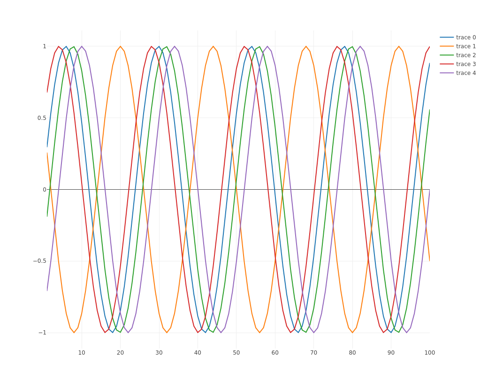
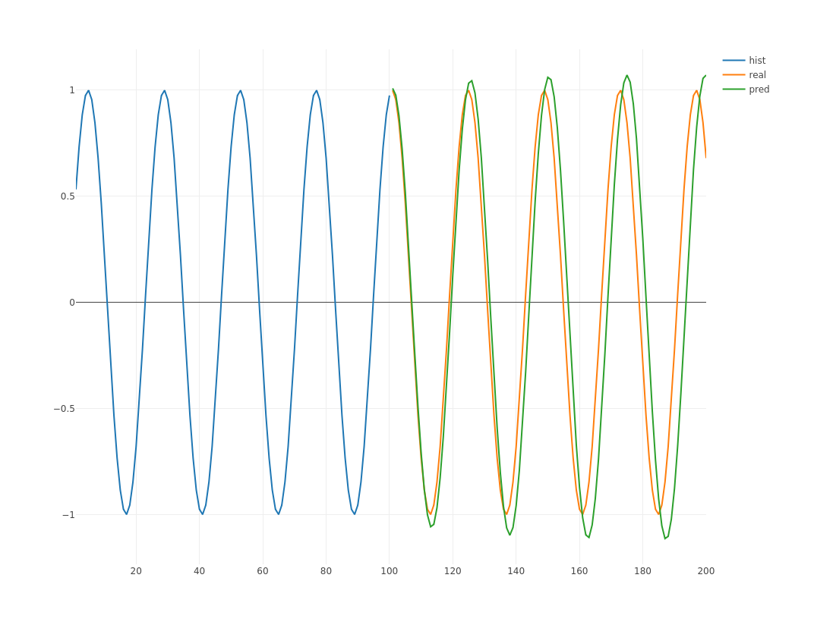

Time-Series
================

> LSTM application to time-series.

This is a hacky demo of how one can perform a time-series model training and inference.

Areas of friction come from the data feed that is expected in a features X batch.size X seq.len format, while array.iter assumes that batches are accessed through the last dimension.

Current custom bucket iterator is designed for text data, which is in batch.size X seq.len format, the features dimension being added by the embedding layer.

Might be preferrable to migrate bucket iterator to a seq\_len X batch.size format and swap axis within model. First need to test potential impact on performance.

``` r
library("readr")
library("dplyr")
library("plotly")
library("mxnet")
```

Load utility functions

``` r
source("rnn.graph.R")
source("rnn.infer.R")
```

### Data preparation

``` r
seq_len = 100
samples = 32

pts <- sin(pi/16 * (1:(seq_len * samples + 1)))

x <- pts[-length(pts)]
x = matrix(x, nrow = seq_len, byrow = F)
x = array(x, dim = c(1, seq_len, samples))
y <- pts[-1]
y = matrix(y, nrow = seq_len, byrow = F)

p1 = plot_ly(x = 1:dim(x)[2], y = x[1,,1], type = "scatter", mode = "lines") %>% 
  add_trace(x = 1:dim(x)[2], y = x[1,,2], type = "scatter", mode = "lines") %>% 
  add_trace(x = 1:dim(x)[2], y = x[1,,3], type = "scatter", mode = "lines") %>% 
  add_trace(x = 1:dim(x)[2], y = x[1,,4], type = "scatter", mode = "lines") %>% 
  add_trace(x = 1:dim(x)[2], y = x[1,,5], type = "scatter", mode = "lines")

p2 = plot_ly(x = 1:length(y[,1]), y = y[,1], type = "scatter", mode = "lines") %>%
  add_trace(x = 1:length(y[,2]), y = y[,2], type = "scatter", mode = "lines")

plotly::export(p1, file = "timeseries_p1.png")
```



### Create data iterators

Hacky array.iter approach: batch.size = seq.length so that the graph is fed with the expected format.

``` r
batch.size = 8

train.data <- mx.io.arrayiter(data = x, label = y, 
                              batch.size = batch.size, shuffle = TRUE)
```

### Model architecture

``` r
symbol <- rnn.graph(num_rnn_layer =  2, 
                    num_hidden = 64,
                    input_size = NULL,
                    num_embed = NULL, 
                    num_decode = 1,
                    masking = F, 
                    loss_output = "linear",
                    dropout = 0.25, 
                    ignore_label = -1,
                    cell_type = "lstm",
                    output_last_state = T,
                    config = "one-to-one")

graph = graph.viz(symbol, type = "graph", direction = "LR", shape=list(data = c(1, 4, 100), label = c(4, 100)))
```

``` r
DiagrammeRsvg::export_svg(graph) %>% charToRaw %>% rsvg::rsvg_png("time_graph.png")
```


### Fit a LSTM model

Needs a custom metric to handle labels in a matrix rather than flat format in the iterator.

``` r
mx.metric.mse.seq <- mx.metric.custom("Perplexity", function(label, pred) {
  label = mx.nd.reshape(mx.nd.array(label), shape = -1)
  label = as.array(label)
  res <- mean((label-pred)^2)
  return(res)
})
```

``` r
ctx <- mx.gpu()

initializer <- mx.init.Xavier(rnd_type = "gaussian", 
                              factor_type = "avg", 
                              magnitude = 2.5)

optimizer <- mx.opt.create("adadelta", rho = 0.9, eps = 1e-5, wd = 1e-12,
                           clip_gradient = 2, rescale.grad = 1/batch.size)

logger <- mx.metric.logger()
batch.end.callback <- mx.callback.log.train.metric(period = 1, logger = logger)
epoch.end.callback <- mx.callback.log.train.metric(period = 1, logger = logger)

system.time(
  model <- mx.model.buckets(symbol = symbol,
                            train.data = train.data, eval.data = NULL, 
                            num.round = 1250, ctx = ctx, verbose = TRUE,
                            metric = NULL, 
                            initializer = initializer, optimizer = optimizer, 
                            batch.end.callback = NULL, 
                            epoch.end.callback = NULL)
)
```

    ## Start training with 1 devices

    ##    user  system elapsed 
    ## 112.668  10.036 105.415

``` r
mx.model.save(model, prefix = "models/model_time_series", iteration = 1)
```

Inference on test data
----------------------

Setup inference data. Need to apply preprocessing to inference sequence and convert into a infer data iterator.

### Inference

``` r
model <- mx.model.load(prefix = "models/model_time_series", iteration = 1)

internals <- model$symbol$get.internals()
sym_state <- internals$get.output(which(internals$outputs %in% "RNN_state"))
sym_state_cell <- internals$get.output(which(internals$outputs %in% "RNN_state_cell"))
sym_output <- internals$get.output(which(internals$outputs %in% "loss_output"))
symbol <- mx.symbol.Group(sym_output, sym_state, sym_state_cell)

predict <- numeric()

data = mx.nd.array(x[, , 1, drop = F])
label = mx.nd.array(y[, 1, drop = F])

infer.data <- mx.io.arrayiter(data = data, label = label, 
                              batch.size = 1, shuffle = FALSE)

mx.symbol.bind = mxnet:::mx.symbol.bind
infer <- mx.infer.buckets.one(infer.data = infer.data, 
                              symbol = symbol,
                              arg.params = model$arg.params, 
                              aux.params = model$aux.params, 
                              input.params = NULL,
                              ctx = ctx)

pred = mx.nd.array(y[seq_len, 1, drop = F])

for (i in 1:100) {
  
  data = mx.nd.reshape(pred, shape = c(1,1,1))
  label = pred
  
  infer.data <- mx.io.arrayiter(data = data, label = label,  
                                batch.size = 1, shuffle = FALSE)
  
  infer <- mx.infer.buckets.one(infer.data = infer.data, 
                                symbol = symbol,
                                arg.params = model$arg.params,
                                aux.params = model$aux.params,
                                input.params = list(rnn.state = infer[[2]], 
                                                    rnn.state.cell = infer[[3]]), 
                                ctx = ctx)
  
  pred <- infer[[1]]
  predict <- c(predict, as.numeric(as.array(pred)))
  
}
```

### Plot predictions against real values

``` r
data = mx.nd.array(x[, , 1, drop = F])
label = mx.nd.array(y[, 1, drop = F])

real = y[1:100, 2]

p = plot_ly(x = 1:dim(y)[1], y = y[,1], type = "scatter", mode="lines", name = "hist") %>% 
  add_trace(x = dim(y)[1] + 1:length(real), y = real, type = "scatter", mode="lines", name = "real") %>% 
  add_trace(x = dim(y)[1] + 1:length(predict), y = predict, type = "scatter", mode="lines", name = "pred")

plotly::export(p, file = "timeseries_pred.png")
```


