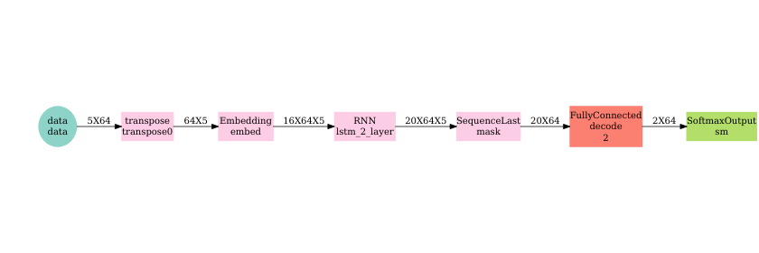
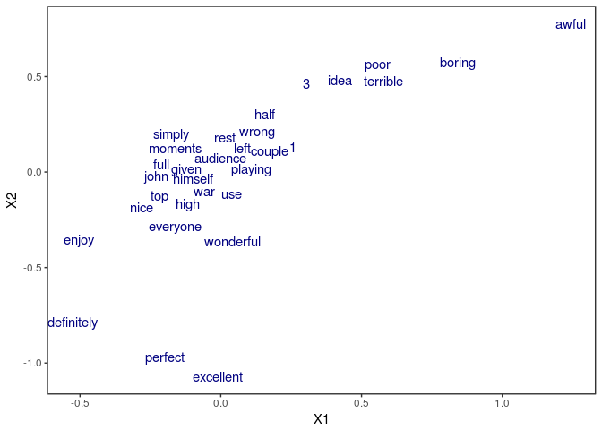

RNN made easy with MXNet R
================

> This tutorial presents an example of application of RNN to texts classification using padded and bucketed data to efficiently handle sequences of varying lengths. It requires running on a GPU with CUDA.

Example based on sentiment analysis on the [IMDB data](http://ai.stanford.edu/~amaas/data/sentiment/).

Load some packages

``` r
require("readr")
require("dplyr")
require("plotly")
require("stringr")
require("stringi")
require("AUC")
require("scales")
require("mxnet")
```

Load utility functions

``` r
source("mx.io.bucket.iter.R")
source("rnn.graph.R")
source("rnn.R")
source("rnn.train.R")
source("rnn.infer.R")
```

What's special about sequence modeling?
---------------------------------------

Whether we're working with text at the character or word level, NLP tasks naturally involves dealing with sequences of varying length.

This can present some challenges as the explicit representation of an unrolled RNN involves a fixed length sequence. Rather than defining new symbolic model for each sequence length, the `mx.symbol.RNN` operator simplifies the process by abstracting the recurring process into a single operator that accepts sequences of varying lengths.

To efficiently feed the RNN network, two tricks can be used:

-   Padding: fill the modeled sequences with an arbitrary word/character up to the longest sequence. This results in sequences of even lengths, but potentially of excessive size for an efficient training.

-   Bucketing: apply the padding trick but to subgroups of samples split according to their lengths. This results in multiples trainings sets, or buckets, within which all samples are padded to an even length.

Below is the graph representation of a seq-to-one architecture. Note that input data is of shape `seq_length X batch.size` while ouput of the RNN operator is of shape `hidden.features X batch.size X seq_length`.

``` r
rnn_graph_seq_one <- rnn.graph(num.rnn.layer = 2, 
                               num.hidden = 20,
                               input.size=100,
                               num.embed=16, 
                               num.label=2,
                               dropout=0.5, 
                               ignore_label = 0,
                               cell.type="lstm",
                               masking = T,
                               config = "seq-to-one")

graph.viz(rnn_graph_seq_one, type = "graph", direction = "LR", graph.height.px = 200, graph.width.px = 800, shape=c(5, 64))
```



Data preparation
----------------

Data preparation is performed by the script: `data.preprocessing.R`.

The following steps are executed:

-   import IMDB.
-   pre-process into lists whose elements are the buckets containing the samples and their associated labels.
-   Split each review into word vectors and apply some common cleansing (remove special characters, lower case, remove extra blank space...)
-   Aggregate the buckets of samples and labels into a list

``` r
corpus_bucketed_train <- readRDS(file = "../data/corpus_bucketed_train.rds")
corpus_bucketed_test <- readRDS(file = "../data/corpus_bucketed_test.rds")

vocab <- length(corpus_bucketed_test$dic)

### Create iterators
batch.size = 64

train.data <- mx.io.bucket.iter(buckets = corpus_bucketed_train$buckets, batch.size = batch.size, data.mask.element = 0, shuffle = TRUE)

eval.data <- mx.io.bucket.iter(buckets = corpus_bucketed_test$buckets, batch.size = batch.size, data.mask.element = 0, shuffle = FALSE)
```

Fit a LSTM model
----------------

``` r
devices <- mx.gpu(0)

initializer <- mx.init.Xavier(rnd_type = "gaussian", factor_type = "avg", magnitude = 2.5)

optimizer <- mx.opt.create("rmsprop", learning.rate = 0.001, gamma1 = 0.95, gamma2 = 0.9, wd = 1e-4, clip_gradient=NULL, rescale.grad=1/batch.size)

logger <- mx.metric.logger()
epoch.end.callback <- mx.callback.log.train.metric(period = 1, logger = logger)
batch.end.callback <- mx.callback.log.train.metric(period = 50)

model <- mx.rnn.buckets(train.data = train.data, eval.data = eval.data,
                        num.round = 10, 
                        ctx = devices, 
                        metric = mx.metric.accuracy, 
                        initializer = initializer, 
                        optimizer = optimizer, 
                        num.rnn.layer = 1, 
                        num.embed = 2, 
                        num.hidden = 5, 
                        num.label = 2, 
                        input.size = vocab, 
                        dropout = 0.25,
                        cell.type = "lstm", 
                        config = "seq-to-one", 
                        batch.end.callback = NULL, 
                        epoch.end.callback = epoch.end.callback,
                        verbose = FALSE)

mx.model.save(model, prefix = "../models/model_sentiment_lstm", iteration = 10)

p <- plot_ly(x = seq_len(length(logger$train)), y = logger$train, type = "scatter", mode = "markers+lines", name = "train") %>% 
  add_trace(y = logger$eval, type = "scatter", mode = "markers+lines", name = "eval")

plotly::export(p, file = "logger_lstm.png")
```


Fit a GRU model
---------------

``` r
logger <- mx.metric.logger()
epoch.end.callback <- mx.callback.log.train.metric(period = 1, logger = logger)
batch.end.callback <- mx.callback.log.train.metric(period = 50)

model <- mx.rnn.buckets(train.data = train.data, eval.data = eval.data,
                        num.round = 10, 
                        ctx = devices, 
                        metric = mx.metric.accuracy, 
                        initializer = initializer, 
                        optimizer = optimizer, 
                        num.rnn.layer = 1, 
                        num.embed = 2, 
                        num.hidden = 5, 
                        num.label = 2, 
                        input.size = vocab, 
                        dropout = 0.25,
                        cell.type = "gru", 
                        config = "seq-to-one", 
                        batch.end.callback = NULL, 
                        epoch.end.callback = epoch.end.callback,
                        verbose = FALSE)

mx.model.save(model, prefix = "../models/model_sentiment_gru", iteration = 10)

p <- plot_ly(x = seq_len(length(logger$train)), y = logger$train, type = "scatter", mode = "markers+lines", name = "train") %>% 
  add_trace(y = logger$eval, type = "scatter", mode = "markers+lines", name = "eval")

plotly::export(p, file = "logger_gru.png")
```


Plot word embeddings
--------------------

Word representation can be visualised by looking at the assigned weights in any of the embedding dimensions. Here, we look simultaneously at the two embeddings learnt in the GRU model.



Inference on test data
----------------------

``` r
ctx <- mx.gpu(0)
batch.size <- 64

corpus_bucketed_test <- readRDS(file = "../data/corpus_bucketed_test.rds")

test.data <- mx.io.bucket.iter(buckets = corpus_bucketed_test$buckets, batch.size = batch.size, data.mask.element = 0, shuffle = FALSE)
```

### LSTM

``` r
model <- mx.model.load(prefix = "../models/model_sentiment_lstm", iteration = 10)
infer <- mx.rnn.infer.buckets(infer_iter = test.data, 
                              model = model,
                              ctx = ctx)

pred_raw <- t(as.array(infer))
pred <- max.col(pred_raw, tie = "first") - 1
label <- unlist(lapply(corpus_bucketed_test$buckets, function(x) x$label))

acc <- sum(label == pred)/length(label)
roc <- roc(predictions = pred_raw[, 2], labels = factor(label))
auc <- auc(roc)
```

Accuracy: 86.7%
AUC: 0.9415

### GRU

``` r
model <- mx.model.load(prefix = "../models/model_sentiment_gru", iteration = 10)
infer <- mx.rnn.infer.buckets(infer_iter = test.data, 
                              model = model,
                              ctx = ctx)

pred_raw <- t(as.array(infer))
pred <- max.col(pred_raw, tie = "first") - 1
label <- unlist(lapply(corpus_bucketed_test$buckets, function(x) x$label))

acc <- sum(label == pred)/length(label)
roc <- roc(predictions = pred_raw[, 2], labels = factor(label))
auc <- auc(roc)
```

Accuracy: 87.1%
AUC: 0.9422
